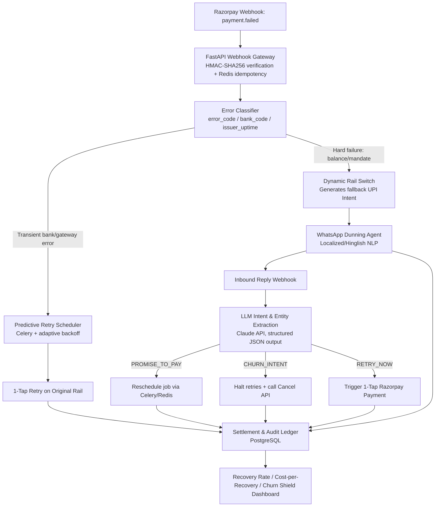

# RazorRescue

**Cross-rail failure recovery, conversational dunning, and churn-shielding for Razorpay recurring payments.**

RazorRescue sits on top of Razorpay's `payment.failed` webhook to recover involuntary payment failures (the 15–20% baseline failure rate on UPI AutoPay, SaaS subscriptions, and digital mandates) — without the retry fatigue, low engagement, and chargeback risk of static email/SMS dunning.

> 🎥 **Demo video:** [Watch the 2-minute walkthrough](#) *(add your Loom link here)*

---

## The Problem

- Most payment failures are **involuntary** — transient bank downtime, async NPCI mandate timeouts, end-of-month liquidity gaps — not deliberate churn.
- Recovery today relies on **static, one-way dunning** (email/SMS with a payment link) that gets <5% engagement, and **same-rail retries** that keep failing if the issuing bank is degraded.
- Unstructured customer replies (*"salary credits Friday, charge me then"*) are ignored by rule-based systems, leading to premature cancellations or unwanted retries.

## The Solution

RazorRescue adds three intelligent layers on top of the existing Razorpay stack:

| Layer | What it does |
|---|---|
| **1. Cross-Rail Dynamic Fallback Switcher** | On transient bank/gateway errors, instantly generates a fallback **1-tap UPI Intent** across an alternate VPA/app (GPay/PhonePe) instead of retrying the same failing rail. |
| **2. Conversational Dunning with Promise-to-Pay** | A WhatsApp agent (Hinglish NLP) parses replies like *"I'll pay Friday"*, extracts the date, pauses retries, and auto-schedules a payment prompt for that exact day. |
| **3. Sentiment-Aware Churn Shield** | Detects explicit cancellation/dissatisfaction intent in replies and immediately halts retries + calls the merchant cancellation API — preventing forced disputes and chargebacks. |

---

## Architecture



**Flow in one line:** `payment.failed` → diagnose → retry same rail *or* switch rail + message the customer → parse their reply → reschedule, retry, or cancel → log everything for recovery-rate reporting.

---

## Repository Structure

```
razorrescue/
├── README.md
├── app/
│   ├── main.py                 # FastAPI webhook gateway
│   ├── classifier.py           # Deterministic error classification
│   ├── retry_scheduler.py      # Celery adaptive backoff jobs
│   ├── rail_switch.py          # UPI Intent fallback generation
│   ├── dunning_agent.py        # WhatsApp send/receive handlers
│   ├── intent_extraction.py    # Claude API intent/entity extraction
│   └── ledger.py                # Postgres models + recovery metrics
├── eval.py                     # Simulation script: RazorRescue vs naive retry
├── data/
│   └── mock_transactions.json  # 50–100 synthetic failed-payment logs
├── tests/
│   └── ...                     # unit tests per module
├── docker-compose.yml
├── requirements.txt
└── .env.example
```

---

## Getting Started

```bash
# 1. Clone and install
git clone https://github.com/<your-username>/razorrescue.git
cd razorrescue
pip install -r requirements.txt

# 2. Configure environment
cp .env.example .env
# Add RAZORPAY_KEY_ID, RAZORPAY_KEY_SECRET, ANTHROPIC_API_KEY, WHATSAPP_TOKEN, DATABASE_URL

# 3. Start supporting services (Redis + Postgres)
docker-compose up -d

# 4. Run the API
uvicorn app.main:app --reload

# 5. Run the Celery worker (separate terminal)
celery -A app.retry_scheduler worker --loglevel=info
```

---

## Simulation / Evaluation (`eval.py`)

`eval.py` replays **50–100 mock `payment.failed` transaction logs** (`data/mock_transactions.json`) through two strategies and compares recovery outcomes:

- **Baseline:** naive same-rail retry on a fixed `T+1 / T+2 / T+3` schedule
- **RazorRescue:** classifier → cross-rail fallback or conversational dunning → simulated reply parsing → reschedule/retry/cancel

```bash
python eval.py --data data/mock_transactions.json
```

**Sample output:**

```
=== RazorRescue Evaluation ===
Transactions simulated:        100

--- Baseline (naive retry) ---
Recovered:                     34 / 100   (34.0%)
Median time-to-recovery:       3.2 days

--- RazorRescue ---
Recovered:                     61 / 100   (61.0%)
Median time-to-recovery:       0.9 days
Cross-rail recoveries:         22
Promise-to-Pay recoveries:     14
Churn-shield cancellations:    9  (chargeback-risk avoided)

--- Net Lift ---
+27.0 percentage points recovered vs. baseline
```

*(Numbers above are illustrative — actual figures are generated fresh each run from `data/mock_transactions.json` and printed/saved to `eval_results.json`.)*

---

## Tech Stack

- **API/Webhooks:** FastAPI, HMAC-SHA256 verification
- **Queue/Scheduling:** Celery + Redis (adaptive backoff, Promise-to-Pay rescheduling)
- **Datastore:** PostgreSQL (event store, audit ledger)
- **NLP/LLM:** Claude API — structured JSON/tool-calling for intent + entity extraction
- **Messaging:** WhatsApp Business API (Meta Cloud API / BSP)
- **Payments:** Razorpay Payments, Subscriptions, and UPI Intent APIs

---

## Roadmap

- [x] Webhook ingestion + idempotency
- [x] Deterministic failure classifier
- [x] Predictive retry scheduler
- [x] Cross-rail UPI Intent fallback
- [x] WhatsApp conversational dunning
- [x] LLM intent/entity extraction (Promise-to-Pay, Churn Intent, Retry-Now)
- [x] Sentiment-aware churn shield
- [ ] Voice/IVR outreach channel
- [ ] Merchant self-serve config dashboard
- [ ] Multi-PSP support beyond Razorpay

---

## Disclaimer

This is a proof-of-concept built for demonstration/evaluation purposes using Razorpay's test-mode APIs and synthetic transaction data. It is not affiliated with or endorsed by Razorpay.
