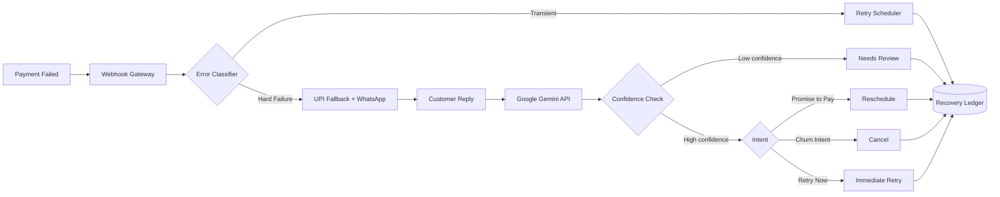

# RazorRescue

**Cross-rail failure recovery, conversational dunning, and churn-shielding for Razorpay recurring payments — with real AI-driven intent classification.**

RazorRescue sits on top of Razorpay's payment.failed webhook to recover involuntary payment failures (the 15-20% baseline failure rate on UPI AutoPay, SaaS subscriptions, and digital mandates) - without the retry fatigue, low engagement, and chargeback risk of static email/SMS dunning.

## The Problem

- Most payment failures are involuntary - transient bank downtime, async NPCI mandate timeouts, end-of-month liquidity gaps - not deliberate churn.
- Recovery today relies on static, one-way dunning and same-rail retries that keep failing if the issuing bank is degraded.
- Unstructured customer replies (like "salary credits Friday, charge me then") are ignored by rule-based systems, leading to premature cancellations or unwanted retries.

## The Solution

1. Cross-Rail Dynamic Fallback Switcher - On transient bank/gateway errors, instantly generates a fallback 1-tap UPI Intent across an alternate VPA/app instead of retrying the same failing rail.
2. Conversational Dunning with Promise-to-Pay - A WhatsApp-style agent parses replies like "I'll pay Friday", extracts the date, pauses retries, and auto-schedules a payment prompt for that exact day.
3. Sentiment-Aware Churn Shield - Detects explicit cancellation or dissatisfaction intent and immediately halts retries plus calls the merchant cancellation API.

## Why AI, and Where

RazorRescue deliberately mixes deterministic rules and generative AI, using each where it fits:

- **Payment failure classification stays rule-based.** Razorpay's error codes (`GATEWAY_TIMEOUT`, `INSUFFICIENT_FUNDS`, etc.) are a fixed, documented, deterministic set. An LLM would add cost and latency here with zero benefit — a lookup table is the correct tool.
- **Customer intent extraction uses a real AI model (Google Gemini).** Customer replies are unstructured, multilingual (English/Hindi/Hinglish), and highly variable. A rule-based keyword approach provably breaks on unseen phrasing — during development, a keyword rule missed "try charging again now" until it was manually patched in. An LLM generalizes across phrasing without needing every variant hand-coded.

The AI's classification is not cosmetic — it directly gates the recovery action, subject to a confidence check:

```
Customer message -> Gemini AI -> intent + confidence -> Reschedule / Cancel / Retry Now / needs_review
```

## Architecture



## Repository Structure

```
razorrescue/
    README.md
    app/
        main.py                 - FastAPI webhook gateway and endpoints
        classifier.py           - Deterministic error classification
        celery_app.py           - Celery configuration
        retry_scheduler.py      - Adaptive backoff retry jobs
        rail_switch.py          - UPI Intent fallback generation
        dunning_agent.py        - Simulated WhatsApp send
        intent_extraction.py    - Real Google Gemini API intent extraction
        actions.py              - Promise-to-Pay, churn, and retry-now handlers
        db.py                   - SQLAlchemy models and Postgres persistence
        config.py               - Env var loading
    data/
        generate_mock_data.py   - Generates 100 seeded mock transactions
        mock_transactions.json
    tests/
        test_classifier.py      - Unit tests for the rule-based classifier
        test_intent_extraction.py - Unit tests for intent extraction
    eval.py                     - Simulation comparing RazorRescue vs naive retry
    eval_results.json           - Latest eval output
    send_test_webhook.py        - Manual test: simulate payment.failed
    send_test_reply.py          - Manual test: simulate inbound WhatsApp reply
    docker-compose.yml          - Redis and Postgres
    requirements.txt
    .env                        - Config, not committed
```

## Getting Started

```bash
# 1. Install dependencies
python -m venv venv
venv\Scripts\activate
pip install -r requirements.txt

# 2. Get a free Google Gemini API key
# Visit aistudio.google.com/apikey, create a key, add it to .env as GEMINI_API_KEY

# 3. Start Redis and Postgres
docker-compose up -d

# 4. Create the database tables
python -c "from app.db import init_db; init_db(); print('Tables created')"

# 5. Run the API (Terminal 1)
uvicorn app.main:app --reload

# 6. Run the Celery worker (Terminal 2)
celery -A app.celery_app worker --loglevel=info --pool=solo

# 7. Test it (Terminal 3)
python send_test_webhook.py
python send_test_reply.py
```

## Confidence-Gated Decisions

Every AI classification includes a confidence score. If Gemini's confidence falls below a threshold (default 0.6), RazorRescue does **not** auto-cancel or auto-reschedule — it routes the case to a `needs_review` state instead, so an uncertain AI classification never triggers a destructive payment action automatically.

```
confidence >= 0.6  -> proceed with AI-selected action
confidence <  0.6  -> needs_review (no automatic action taken)
```

If the Gemini API call itself fails or times out, the system falls back to a safe `UNCLEAR` / zero-confidence result rather than crashing the webhook handler — the recovery pipeline stays available even if the external AI service is degraded.

## Audit Trail

Every AI decision is persisted to PostgreSQL, not just logged to a terminal: the customer's raw message, the extracted intent, sentiment score, confidence score, and the recovery action ultimately taken. This makes every automated decision fully inspectable after the fact.

## Evaluation (eval.py)

eval.py replays 100 seeded mock payment.failed transactions through two strategies:

- Baseline: naive same-rail retry on a fixed schedule
- RazorRescue: classify, then cross-rail fallback or conversational dunning, then real AI-based intent classification driving reschedule, retry, or cancel

```bash
python data/generate_mock_data.py
python eval.py
```

The evaluation calls the real Gemini API for intent classification (cached per unique message text to stay within free-tier rate limits), so the reported recovery lift reflects genuine AI-driven decisions, not a keyword mock.

*Note: recovery-probability assumptions used in the simulation (e.g. how likely a Promise-to-Pay reply is to actually result in payment) are informed estimates based on the problem's baseline stats, not measured production data. The AI classification step itself is real; the downstream conversion probabilities are simulation assumptions pending real merchant data.*

## Tech Stack

- API/Webhooks: FastAPI, HMAC-SHA256 verification, Redis idempotency
- Queue/Scheduling: Celery + Redis (adaptive backoff, Promise-to-Pay rescheduling)
- Datastore: PostgreSQL via SQLAlchemy
- AI / NLP: Google Gemini API (`gemini-2.5-flash`) for intent classification, sentiment, entity extraction, and confidence scoring on unstructured customer replies
- Payments: Razorpay webhook model, simulated UPI Intent generation

## Status / Roadmap

**Done:**
- Webhook ingestion and idempotency
- Deterministic failure classifier
- Predictive retry scheduler (Celery, adaptive backoff)
- Cross-rail UPI Intent fallback generation
- Simulated WhatsApp dunning
- Real AI-driven intent extraction via Google Gemini API
- Confidence-gated action dispatch with needs_review fallback
- AI API failure handling with safe fallback
- Full AI decision audit trail persisted to Postgres
- Promise-to-Pay, Churn Shield, and Retry-Now action dispatch
- Unit tests for classifier and intent extraction

**Not yet done:**
- Real WhatsApp Business API integration (currently simulated)
- Real Razorpay sandbox integration (live UPI Intent and cancellation API)
- AI-specific tests using a mocked Gemini client (no live API calls)
- Full eval.py run with completed real-AI evaluation numbers (pending Gemini free-tier quota reset)

## Disclaimer

This is a proof-of-concept built for demonstration and evaluation purposes using simulated payment and messaging data. It is not affiliated with or endorsed by Razorpay or Google.
